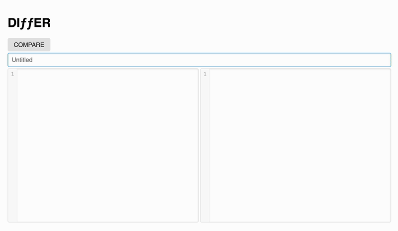

Self-hosted diff tool that compares two versions of text and saves the differences. A simple alternative to diffchecker.com.

## Features

- Compare two versions of text and highlight the differences.
- Save the differences with a unique shareable link.
- Edit existing differences and save them as new versions.

## Installation

1. Copy `.env.example` to `.env` and change values if needed:

   - `DB`: connection string to PostgreSQL database
   - `INSTANCES`: number of PM2 instances inside a container
   - `NODE_ENV`: `development`|`production` - affects stack tracing on error pages

2. `docker compose up -d --build`

## Usage

1. Open service instance.
2. Enter the text in the left and right text areas.
3. Click the `Compare` button.
4. The differences will be highlighted.
5. Check the differences and make sure that everything is correct.
6. You can get back to editing source files if needed. Click `Edit` button.
7. Optionally add diff name. For instance, you can add a ticket number.
8. Click the `Save` button to save the differences.
9. Copy the link and share it with others.

Also, you can edit existing differences and save them as new versions.

1. Open the link with the differences.
2. Click on the `Edit` button.
3. Edit the differences.
4. Click on the `Save` button to save the changes.
5. A new link will be generated.

## How it works

1. Unified diff of 2 texts is computed on client side
2. Diff is deflated (compressed with DEFLATE algo) also on client side
3. Resulting data is saved to database
4. When link is opened then reverse process is taking place

This service is built on top of a bunch of great open-source libraries:

- [jsdiff](https://github.com/kpdecker/jsdiff)
- [diff2html](https://github.com/rtfpessoa/diff2html)
- [pako](https://github.com/nodeca/pako)
- [buffer](https://github.com/feross/buffer)
- [micromodal](https://github.com/ghosh/Micromodal)
- [dateformat](https://github.com/felixge/node-dateformat)
- [pure-css](https://github.com/pure-css/pure)

## Contributing

Contributions are welcome! If you find any issues or have suggestions for improvements, please open an issue or submit a pull request.

## License

This project is licensed under the MIT License. See the [LICENSE](LICENSE) file for more information.
