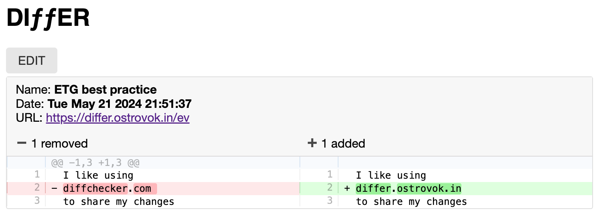

# Differ

Text diff tool that compares two versions of text and saves the differences.

## Features

- Compare two versions of text and highlight the differences.
- Save the differences with a unique shareable link.
- Edit existing differences and save them as new versions.

## Usage

1. Open https://differ.ostrovok.in/
2. Enter the text in the left and right text areas.
3. Click on the `Compare` button.
4. The differences will be highlighted.
5. Check the differences and make sure that everything is correct.
6. You can get back to editing source files if needed. Click `Edit` button.
7. Add diff name as optional. For instance, you can add a ticket number.
8. Click on the `Save` button to save the differences.
9. Copy the link and share it with others.

Also, you can edit existing differences and save them as new versions.

1. Open the link with the differences.
2. Click on the `Edit` button.
3. Edit the differences.
4. Click on the `Save` button to save the changes.
5. A new link will be generated.

## Contributing

Contributions are welcome! If you find any issues or have suggestions for improvements, please open an issue in the team tracker https://red.ostrovok.in/projects/toolbox or submit a pull request.
Also, you can contact the team directly in Slack channel #tool-differ

## License

This project is licensed under the MIT License. See the [LICENSE](LICENSE) file for more information.
